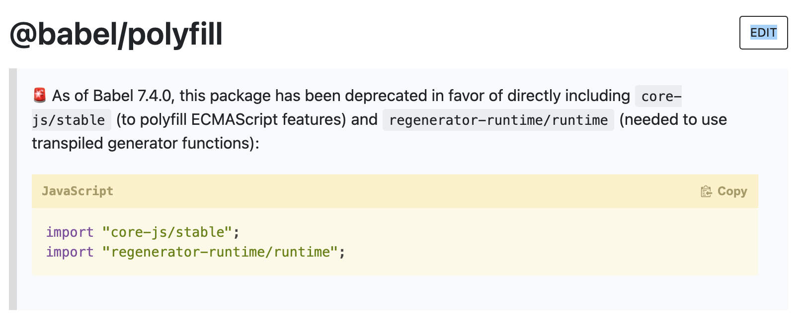
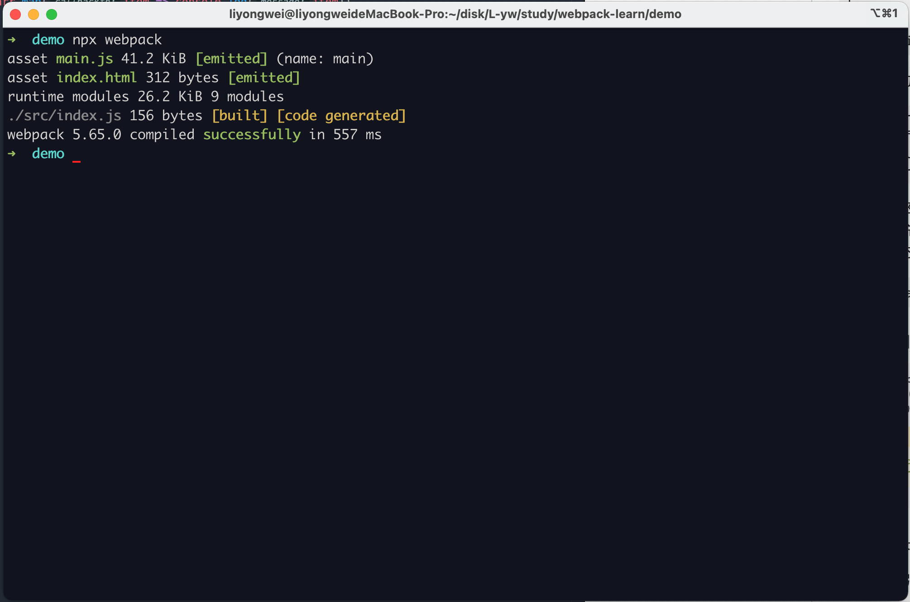
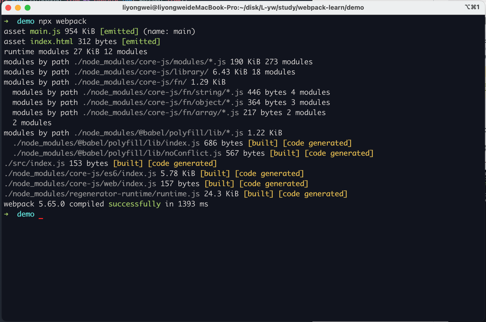
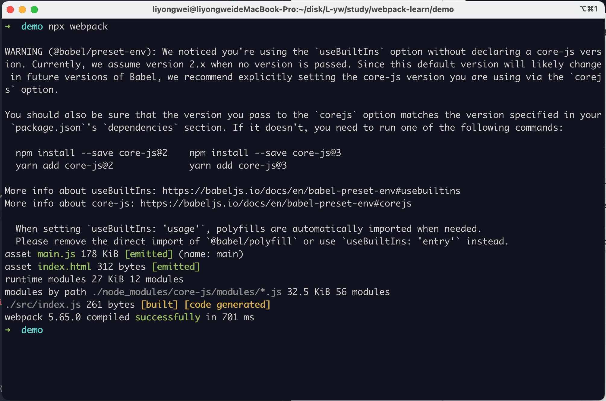

# 11.webpack 处理 ES6 语法

babel 把 ES6 转成 ES5 代码

按照 babel 官网配置

```shell
npm install --save-dev babel-loader @babel/core
```

在 webpack.config.js 的 module 中配置 babel-loader

```javascript
// webpack.config.js

module.exports = {
  // ...其他配置
  module: {
    rules: [
      // ... 其他 loader 配置
      {
        test: /\.m?js$/,
        exclude: /node_modules/,
        use: {
          loader: "babel-loader",
          options: {
            presets: ['@babel/preset-env']
          }
        }
      }
    ]
  }
}
```

```shell
npm install @babel/preset-env --save-dev
```

当使用 babel-loader 处理 js 文件时, 实际上babel-loader 只是 webpack 和 babel 做通信桥梁, babel-loader 并不会把 ES6 代码转成 ES5,会借助其他的模块,才能完成转换. `@babel/preset-env` 就是这样的一个模块, 包含所有 ES6 转成 ES5 的规则.

创建 `babel.config.json` 文件

```json
{
  "presets": ["@babel/preset-env"]
}
```

index.js 中代码如下

```javascript
const arr = [
  new Promise(() => { }),
  new Promise(() => { })
]

arr.map(item => console.log(item))
```

打包生成的代码如下

```
eval("var arr = [new Promise(function () {}), new Promise(function () {})];\narr.map(function (item) {\n  return console.log(item);\n});\n\n//# sourceURL=webpack://webpack-demo/./src/index.js?");
```

制转换一部分,还有一部分函数,对象在低版本浏览器还是没有的,不仅要做转换,还要补充低版本,需借助 babel-polyfill,帮助我们做变量,函数等在低版本浏览器的补充

```shell
npm install --save @babel/polyfill
```



在 src 目录下的 index.js 顶部引入 `import"@babel/polyfill";`

但是,在未引入 `import"@babel/polyfill";` 时, 打包生成的 main.js 大小为 



引入 `import"@babel/polyfill";` 后,打包生成的 main.js 大小为



是 @babel/polyfill 把其他暂时不需要的语法打包进了 main.js, 主需要实现 map,Promise 的转换,需修改配置

```
// webpack.config.js

module.exports = {
  // ...其他配置
  module: {
    rules: [
      // ... 其他 loader 配置
      {
        test: /\.m?js$/,
        exclude: /node_modules/,
        use: {
          loader: "babel-loader",
          options: {
            // 为 preset-env 增加参数, 根据业务代码用到的 ES6 语法进行转换
            presets: [['@babel/preset-env', {
              useBuiltIns: 'usage'
            }]]
          }
        }
      }
    ]
  }
}
```

这样打包出来的代码如下



但是,`当打包一个第三方模块或者一个 ui 组件库的时候, import"@babel/polyfill";` 会造成全局污染,需要换一种方案

安装 `npm install --save-dev @babel/plugin-transform-runtime `

安装 `npm install --save @babel/runtime`

在 webpack.config.js 中配置

```javascript
// webpack.config.js

module.exports = {
  // ...其他配置
  module: {
    rules: [
      // ... 其他 loader 配置
      {
        test: /\.m?js$/,
        exclude: /node_modules/,
        use: {
          loader: "babel-loader",
          options: {
            // 为 preset-env 增加参数, 根据业务代码用到的 ES6 语法进行转换
            // presets: [['@babel/preset-env', {
            //  useBuiltIns: 'usage'
            // }]]
            "plugins": [["@babel/plugin-transform-runtime",{
               "absoluteRuntime": false,
               "corejs": false,
               "helpers": true,
               "regenerator": true,
               "version": "7.0.0-beta.0"
            }]]
          }
        }
      }
    ]
  }
}

```

可以把 webpack.config.js 中 babel-loader 中 options 的配置项提取到 .babelrc 中
