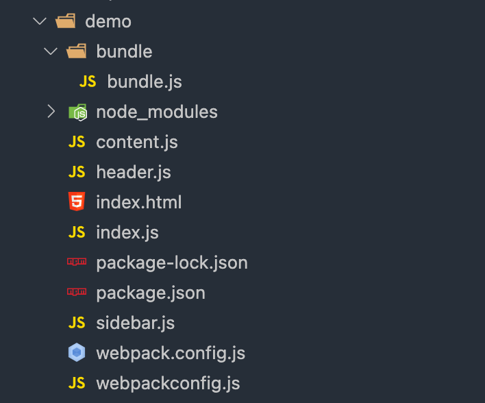
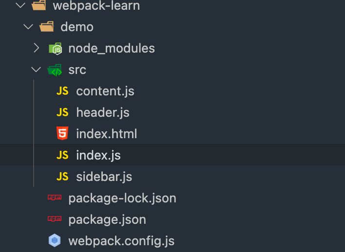
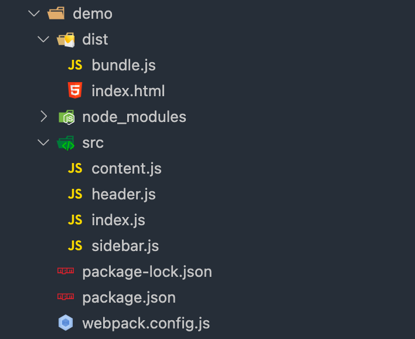

# 2.webpack 配置



`webpack4.0` 以后的版本提供默认的配置项

执行 `npx webpack` 命令, 执行的就是 `webpack` 提供的默认配置项, 即项目中根目录下的 `webpack.config.js`

若没有 webpack.config.js 文件,打包就会报错,需指定配置文件,执行 `npx webpack --config webpackconfig.js`

文件目录调整如下:



调整 `webpack.config.js` 打包的入口

```javascript
const path = require('path')

module.exports = {
  entry: './src/index.js',
  output: {
    filename: 'bundle.js',
    path: path.resolve(__dirname, 'dist')
  }
}
```

## npm script 简化打包命令

修改 `package.json`

```json
{
  "name": "webpack-demo",
  "version": "1.0.0",
  "description": "",
  "private": true,
  "scripts": {
    "bundle": "webpack"
  },
  "author": "liyongwei",
  "license": "ISC",
  "devDependencies": {
    "webpack": "^5.65.0",
    "webpack-cli": "^4.9.1"
  }
}
```

执行 `npm run bundle` 时, node会优先执行当前目录下的 `webpack`

调整 index.html 至 dist 目录下,文件目录结构如下


