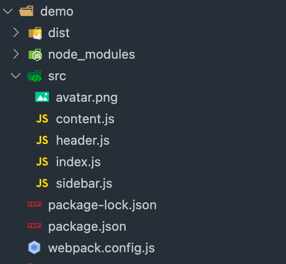
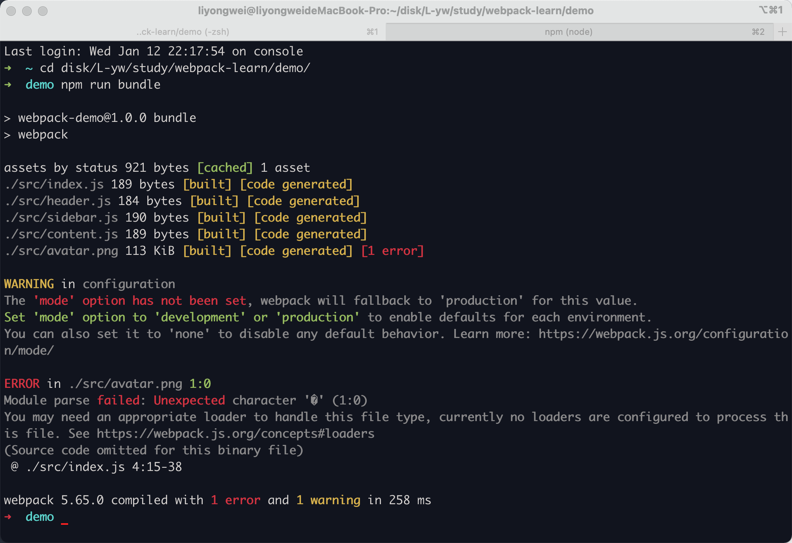
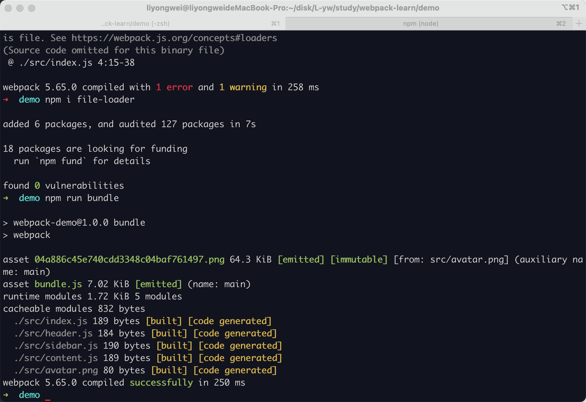
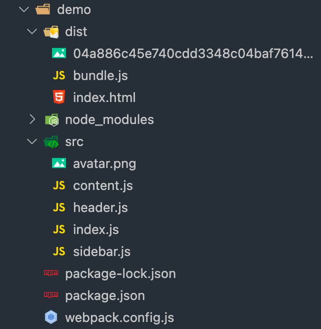
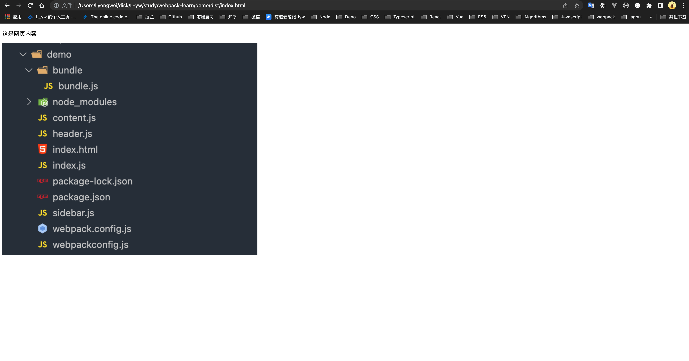

# 3.webpack 中的 Loader

## 什么是 Loader



### 打包图片

当在代码中引入图片时,再打包时

```javascript
// index.js

const Header = require('./header')
const Sidebar = require('./sidebar')
const Content = require('./content')
const avatar = require('./avatar.png')

new Header()
new Sidebar()
new Content()
```

执行 `npm run bundle`



此时打包报错,原本 webpack只能处理  .js 文件,当遇到其他类型的文件时,webpack 程序无法处理,所以报错

需要我们在配置文件中 `webpack.config.js` 中告诉webpack 遇到 `.png` 的文件该怎么处理

```javascript
const path = require('path')

module.exports = {
  mode: 'development',
  entry: {
    main: './src/index.js'
  },
  module: {
    rules: [
      {
        test: /\.jpg|png$/,
        use: {
          loader: 'file-loader'
        }
      }
    ]
  },
  output: {
    filename: 'bundle.js',
    path: path.resolve(__dirname, 'dist')
  }
}
```

再次执行 `npm run bundle`, 得到如下结果



在 `dist` 目录中生成如下



### 回顾打包流程

* 首先准备对 index.js 文件进行打包,
* 然后在命令行中运行 `npm run bundle` 命令, 执行的是 `package.json` 中的scripts中的 `"bundle":"webpack"`, 实际运行的是 webpack 的命令
* `webpack` 获取读取配置文件 `webpack.config.js` 根据配置文件做打包
* 当 `webpack` 在打包过程中遇到 `js` 文件默认能够处理;
* 但是当遇到 `.png` 文件时,`webpack` 默认不能处理,但是在配置文件中有相应的配置即:
  ```javascript
  rules: [
    {
      test: /\.png$/,
      use: {
        loader: 'file-loader'
      }
    }
  ]
  ```

这段配置是在告诉 `webpack`, 当遇到 `.png` 文件时,通过 `file-loader` 打包 `.png` 文件

### file-loader 做了哪些事情

* 当在代码中引入图片模块时, 首先会把图片移动到dist 目录下,同时更改名字,名字也是可以自定义的
* 当把图片移动到 dist 目录后,会得到图片相对于 dist 目录的名称, 会把名称作为返回值返回给对应的变量

`file-loader 可以处理文件类型的资源`

`loader` 是一个打包方案, 知道对于某个特定的文件, `webpack` 应该如何打包,应为本身 `webpack` 只能处理 `js` 文件,不能处理其他类型的文件, 但是可以通过 `loader` 处理其他类型的文件

在 index.js 中去掉其他的 js 文件的引用,只保留图片的引入

```javascript
import avatar from './avatar.png'

const img = new Image()
img.src = avatar

const root = document.getElementById('root')
root.append(img)
```

重新打包后, 页面显示效果如下



**`简单来说, Loader 就是 webpack 处理其他非 js 文件的一种方案`**
