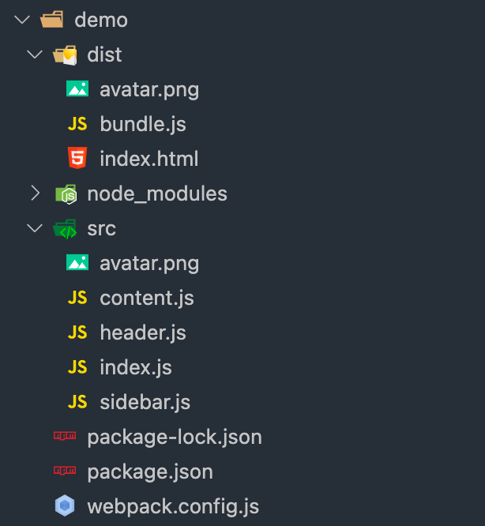
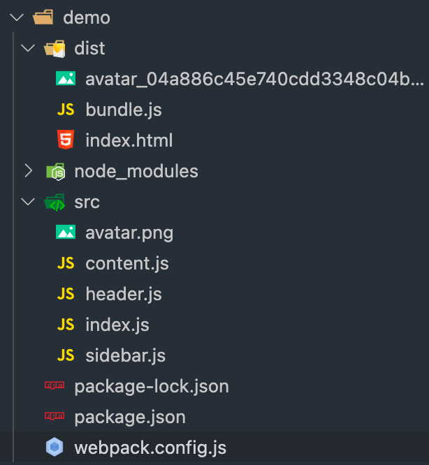
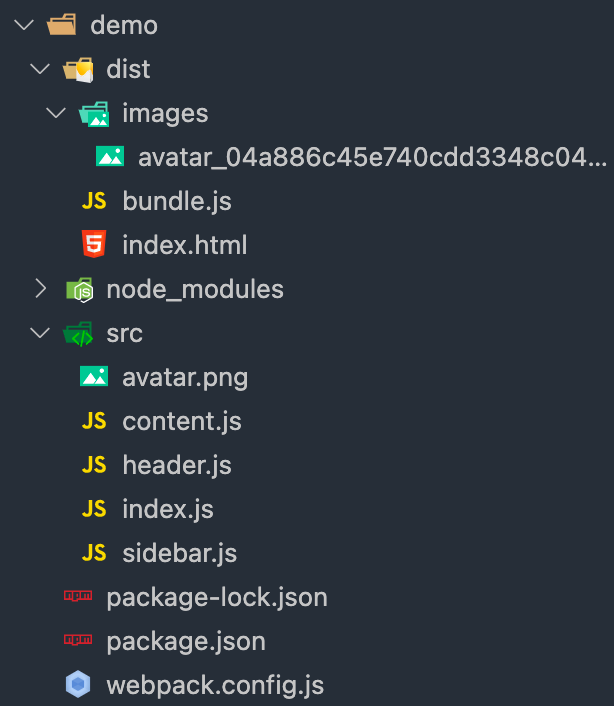
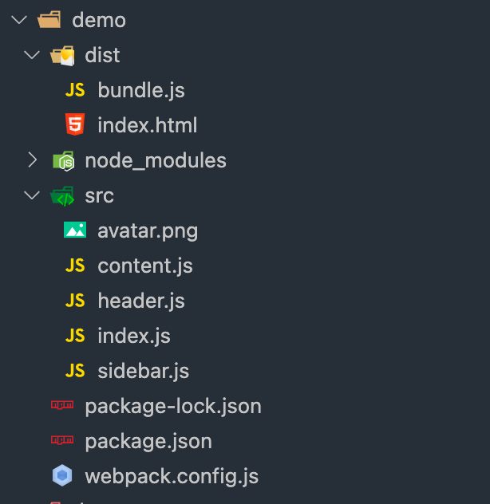
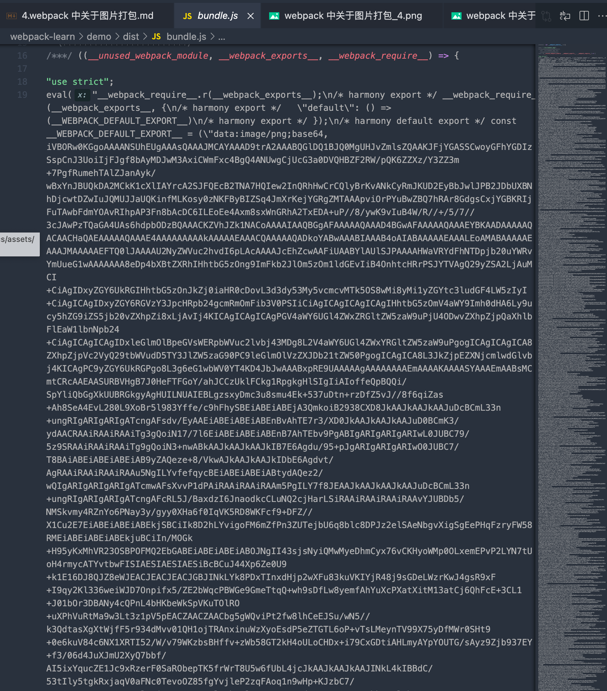
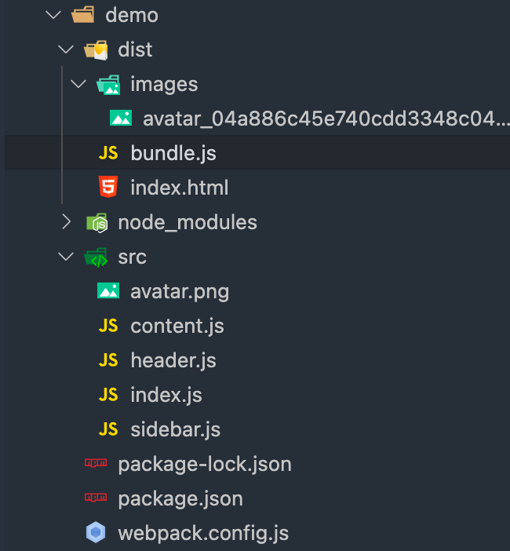

## 4.webpack 中静态资源打包-图片

通过 file-loader 能够帮助 webpack 对.png 格式的图片做打包,但是打包出来的名字是有变化的,不在是原来的 avatar, 此时需要通过 file-loader 的配置做处理

在 `webpack.config.js` 中修改 `file-loader` 的配置

```javascript
const path = require('path')

module.exports = {
  mode: 'development',
  entry: {
    main: './src/index.js'
  },
  module: {
    rules: [
      {
        test: /\.(jpg|png)$/,
        use: {
          loader: 'file-loader',
          options: {
            name: '[name].[ext]' // 配置打包出来的文件名字以及后缀和原来的一样
          }
        }
      }
    ]
  },
  output: {
    filename: 'bundle.js',
    path: path.resolve(__dirname, 'dist')
  }
}

```

`options: { name: '[name].[ext]' }` placeholer 语法, 中文名占位符



也可以作如下配置,加上 hash

`options: { name: '[name]_[hash].[ext]' `

这样打包出来的文件名字中是带有 hash 值的



匹配多种格式的图片

```javascript
rules: [
  {
    test: /\.(jpg|png)$/, // 匹配以 jpg 或者 png 结尾的图片
    use: {
      loader: 'file-loader',
      options: {
        name: '[name].[ext]' // 配置打包出来的文件名字以及后缀和原来的一样
      }
    }
  }
]
```

指定打包出来的图片放的目录

```javascript
rules: [
  {
    test: /\.(jpg|png)$/, // 匹配以 jpg 或者 png 结尾的图片
    use: {
      loader: 'file-loader',
      options: {
        name: '[name].[ext]' // 配置打包出来的文件名字以及后缀和原来的一样
        outputPath: 'images/path' // 打包出来的图片放在 dist 目录下的 images 文件夹中
      }
    }
  }
]
```

打包结果: 



和 `file-loader` 很类似的 `url-loader`

```javascript
const path = require('path')

module.exports = {
  mode: 'development',
  entry: {
    main: './src/index.js'
  },
  module: {
    rules: [
      {
        test: /\.(jpg|png)$/,
        use: {
          loader: 'url-loader', // 修改为 url-loader
          options: {
            name: '[name]_[hash].[ext]',
            outputPath: 'images/'
          }
        }
       }
     ]
  },
  output: {
    filename: 'bundle.js',
    path: path.resolve(__dirname, 'dist')
  }
}
```

url-loader 是把图片变成 base64 编码放在 `bundle.js` 中, 

* 好处是节省一次请求图片的 http 请求
* 坏处是可能会导致打包出来的 bundle.js 文件体积偏大

**好的做法是判定不同大小的图片,是放在 js 代码里面,还是放在 js 代码外面,以 http 请求的方式加载**

增加 `limit` 配置项

```javascript
const path = require('path')

module.exports = {
  mode: 'development',
  entry: {
    main: './src/index.js'
  },
  module: {
    rules: [
      {
        test: /\.(jpg|png)$/,
        use: {
          loader: 'url-loader', // 修改为 url-loader
          options: {
            name: '[name]_[hash].[ext]',
            outputPath: 'images/',
            limit: 2048 // 图片大小的阈值
          }
        }
       }
     ]
  },
  output: {
    filename: 'bundle.js',
    path: path.resolve(__dirname, 'dist')
  }
}

```

limit的作用: 如果图片超过 2048个字节,就像 file-loader 一样,把图片打包到 dist 目录下生成一个图片文件; 但是如果小于 2048个字节,就把图片变成 base64编码放在 bundle.js 里面

测试: limit: 204800,此时的图片是以 base64编码的形式放在 bundle.js 中的

此时打包的结果





测试: limit: 2048, 此时的图片是大于 2048个字节, 会放在 images 文件夹下,而且在 bundle.js 中没有 base64 编码

此时打包的结果


