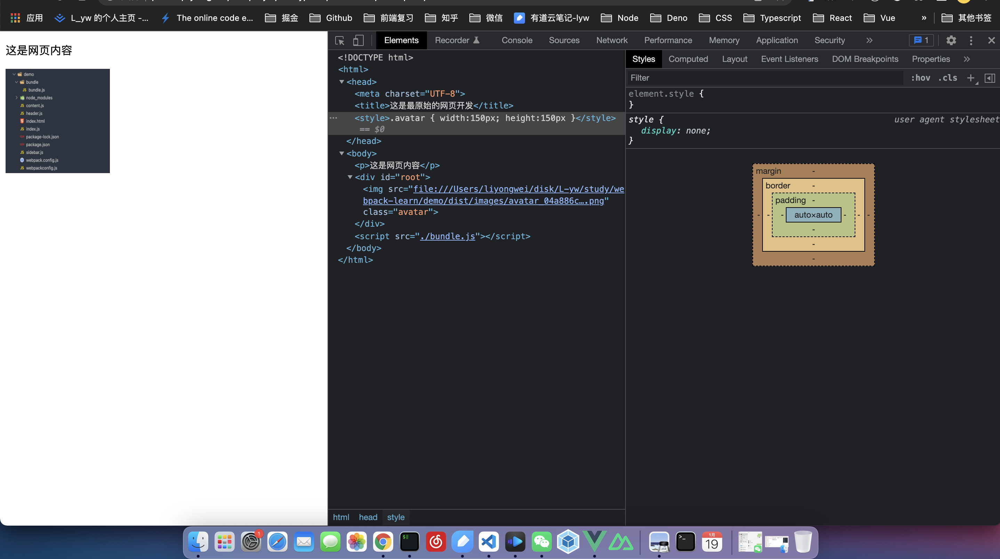
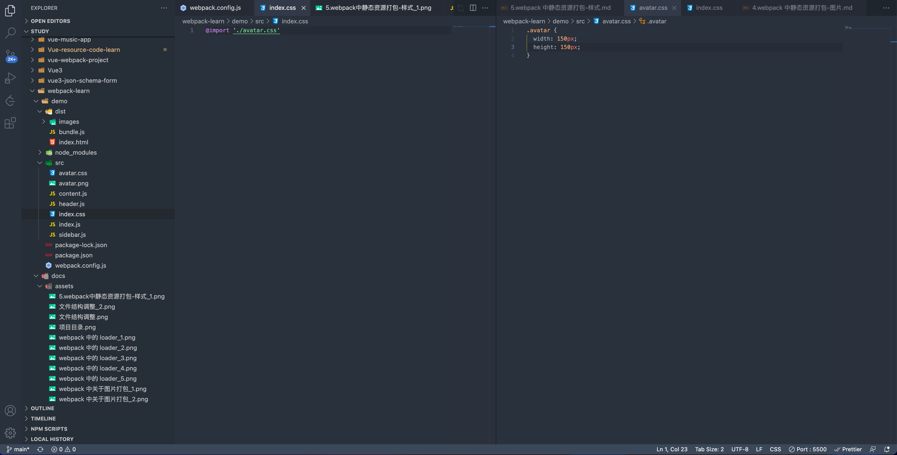
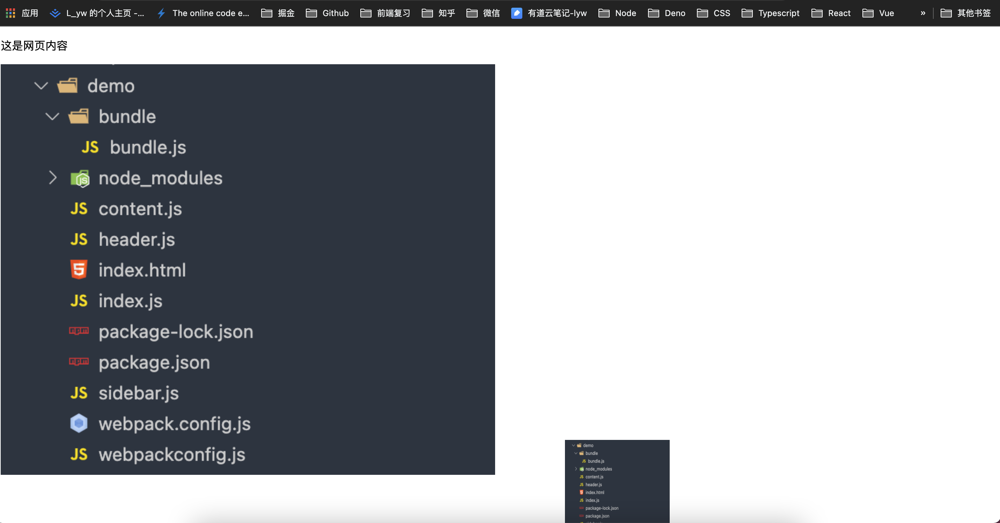
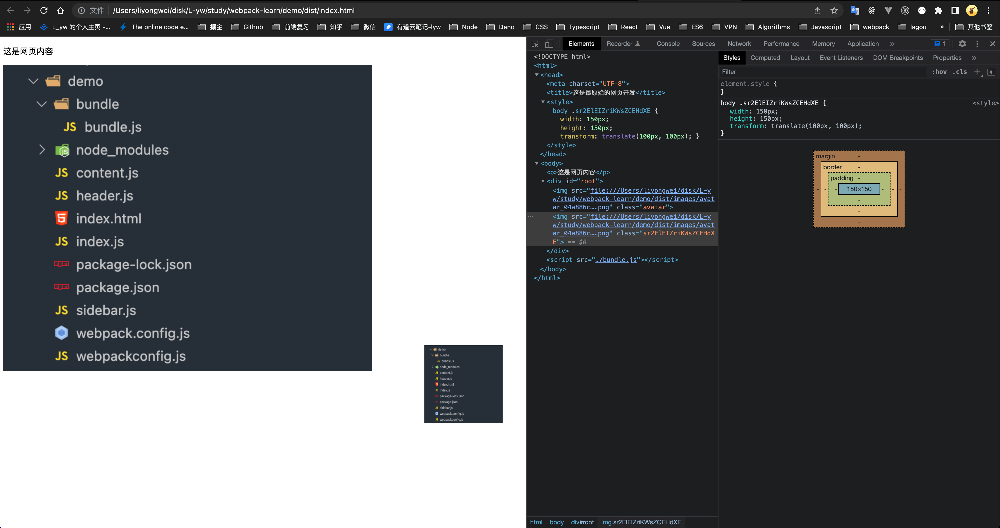

# 5.webpack中静态资源打包-样式

在 src 目录下增加 index.css 样式文件,修饰页面样式

```css
/*index.css*/

.avatar {
  width: 150px;
  height:150px;
}
```

在 index.js 中引入 index.css 文件

```javascript
import avatar from './avatar.png'
// 引入 css 文件
import './index.css'

const img = new Image()
img.src = avatar
// 在 img 上添加 class 名
img.classList.add('avatar')

const root = document.getElementById('root')
root.append(img)

```

此时要修改 `webpack.config.js` 中的配置,添加 `css-loader,style-loader` 处理 css 文件,同时安装 css-loader 和 style-loader

```javascript
const path = require('path')

module.exports = {
  mode: 'development',
  entry: {
    main: './src/index.js'
  },
  module: {
    rules: [
      {
        test: /\.(jpg|png)$/,
        use: {
          loader: 'url-loader', // 修改为 url-loader
          options: {
            name: '[name]_[hash].[ext]',
            outputPath: 'images/',
            limit: 2048 // 图片大小的阈值
          }
        }
       },
       // 添加处理 css 文件的配置
       {
         test: /\.css$/,
         use: [
           {
             loader: 'style-loader'
           },
           {
             loader: 'css-loader'
           }
         ]
       }
     ]
  },
  output: {
    filename: 'bundle.js',
    path: path.resolve(__dirname, 'dist')
  }
}
```

打包后页面渲染如下



## css-loader 和 style-loader 的作用

通过 css 的模块化的方式引入 css 文件

新建 avatar.css, 在 index.css 中引入

```css
/* avatar.css */

.avatar {
  width: 150px;
  height: 150px;
}
```

```css
/* index.css */

@import './avatar.css'
```



此时再次打包后,页面的渲染效果是一样的

在此次打包过程中,

* css-loader: `css-loader`分析出几个css 文件之间的关系,最终把这些有关系的 css 文件合并成一段 css
* style-loader: 在得到 `css-loader` 生成的 css 的内容之后,`style-loader` 会把生成的 css 内容挂载到 Dom 的 head 部分

## 在代码中写 sass,less,stylus处理 css 预编译的文件

修改 `index.css` 成 `index.scss`, 把 `avatar.css` 中的内容复制到 `index.scss` 中,暂时不再引用 `avatar.css`

在 index.js 中引入 index.scss

此时打包会报错,webpack 目前无法处理 .scss 文件

需要修改 webpack.config.js 中的配置,针对 .scss 文件处理,而且需要 sass-loader 处理

```javascript
const path = require('path')

module.exports = {
  mode: 'development',
  entry: {
    main: './src/index.js'
  },
  module: {
    rules: [
      {
        test: /\.(jpg|png)$/,
        use: {
          loader: 'url-loader', // 修改为 url-loader
          options: {
            name: '[name]_[hash].[ext]',
            outputPath: 'images/',
            limit: 2048 // 图片大小的阈值
          }
        }
       },
       // 添加处理 css 文件的配置
       {
         test: /\.scss$/,
         use: [
           {
             loader: 'style-loader'
           },
           {
             loader: 'css-loader'
           },
           {
             loader: 'sass-loader'
           }
         ]
       }
     ]
  },
  output: {
    filename: 'bundle.js',
    path: path.resolve(__dirname, 'dist')
  }
}

```

再次打包,页面渲染效果才会正常

**`在 webpack 的配置里面,loader 是有先后顺序的,执行顺序是从右到左.本篇中,当打包遇到一个 sass 文件时,首先执行 sass-loader, 对 sass 代码进行翻译,翻译成 css 代码后,给到 css-loader,处理好之后,再给到 style-loader 挂载到页面上`**

## postcss-loader 实现样式携带厂商前缀

先安装 postcss-loader, autoprefixer

在 webpack.config.js 中添加 postcss-loader 的配置

```javascript
const path = require('path')

module.exports = {
  mode: 'development',
  entry: {
    main: './src/index.js'
  },
  module: {
    rules: [
      {
        test: /\.(jpg|png)$/,
        use: {
          loader: 'url-loader', // 修改为 url-loader
          options: {
            name: '[name]_[hash].[ext]',
            outputPath: 'images/',
            limit: 2048 // 图片大小的阈值
          }
        }
       },
       // 添加处理 css 文件的配置
       {
         test: /\.scss$/,
         use: [
           {
             loader: 'style-loader'
           },
           {
             loader: 'css-loader'
           },
           {
             loader: 'sass-loader'
           },
           {
             loader: 'postcss-loader' // 添加 postcss-loader 处理 scss 文件
           }
         ]
       }
     ]
  },
  output: {
    filename: 'bundle.js',
    path: path.resolve(__dirname, 'dist')
  }
}
```

创建 postcss.config.js

```javascript
// postcss.config.js

module.exports = {
  plugins: [
    require('autoprefixer')
  ]
}
```

## css-loader配置

在 webpack.config.js 中修改 css-loader 

```javascript
const path = require('path')

module.exports = {
  mode: 'development',
  entry: {
    main: './src/index.js'
  },
  module: {
    rules: [
      {
        test: /\.(jpg|png)$/,
        use: {
          loader: 'url-loader', // 修改为 url-loader
          options: {
            name: '[name]_[hash].[ext]',
            outputPath: 'images/',
            limit: 2048 // 图片大小的阈值
          }
        }
       },
       // 添加处理 css 文件的配置
       {
         test: /\.scss$/,
         use: [
           {
             loader: 'style-loader'
           },
           {
             loader: 'css-loader',
             // css-loader 新增的配置项
             options: {
               importLoaders: 2 
             }
           },
           {
             loader: 'sass-loader'
           },
           {
             loader: 'postcss-loader' // 添加 postcss-loader 处理 scss 文件
           }
         ]
       }
     ]
  },
  output: {
    filename: 'bundle.js',
    path: path.resolve(__dirname, 'dist')
  }
}

```

`{ loader: 'css-loader', // css-loader 新增的配置项 options: { importLoaders: 2  } },`

在.scss 文件中,通过 `@import` 引入的 .scss 文件也要同样走一遍打包 .scss 文件的 loaders. `可以保证无论是在 js 文件中引入 scss 文件,还是在 scss 或者 css 中引入的 scss 文件都会经过所有的 loaders 的处理`

如: 在 index.scss 引入 avatar.scss

```scss
@import './avatar.scss';

body {
  .avatar {
    width: 150px;
    height: 150px;
    transform: translate(100px, 100px);
  }
}

```

如果不配置 importLoaders: 2, 通过 @import 导入的 .scss 文件就不会再次经过所有的 loaders 的处理, 而是直接通过 css-loader 开始处理

## css 的模块化打包

```javascript
import avatar from './avatar.png'
// 引入 css 文件
import './index.scss'

const img = new Image()
img.src = avatar
// 在 img 上添加 class 名
img.classList.add('avatar')

const root = document.getElementById('root')
root.append(img)
```

目前的 index.js 中 目前的逻辑: 引入图片,和 scss 样式文件,然后创建 img,设置 img 的 src 属性,同时给 img 添加 avatar 类名, 在 root dom 元素下添加创建的 img

现在抽离创建 img,并添加到 root 下到额外的函数createAvatar中

```javascript
// createAvatar.js

import avatar from './avatar.png'

function createAvatar() {
  const img = new Image()
  img.src = avatar
  // 在 img 上添加 class 名
  img.classList.add('avatar')

  const root = document.getElementById('root')
  root.append(img)
}

export default createAvatar
```

在 index.js 中引入 createAvatar 函数

```javascript
// index.js

import avatar from './avatar.png'
// 引入 css 文件
import './index.scss'
import createAvatar from "./createAvatar";

createAvatar()

const img = new Image()
img.src = avatar
// 在 img 上添加 class 名
img.classList.add('avatar')

const root = document.getElementById('root')
root.append(img)
```

在这种情况中,导入的 index.scss 文件中的样式会作用于通过 createAvatar 函数创建的 img,也会作用于

`const img = new Image()
img.src = avatar
// 在 img 上添加 class 名
img.classList.add('avatar')`

生成的 img

`import './index.scss'` 相当于是引入的全局样式,需要引入 css 模块化的概念.使 引入的 css 只在模块内生效

在 webpack.config.js 中 css-loader 增加如下配置

```javascript
const path = require('path')

module.exports = {
  mode: 'development',
  entry: {
    main: './src/index.js'
  },
  module: {
    rules: [
      {
        test: /\.(jpg|png)$/,
        use: {
          loader: 'url-loader', // 修改为 url-loader
          options: {
            name: '[name]_[hash].[ext]',
            outputPath: 'images/',
            limit: 2048 // 图片大小的阈值
          }
        }
       },
       // 添加处理 css 文件的配置
       {
         test: /\.scss$/,
         use: [
           {
             loader: 'style-loader'
           },
           {
             loader: 'css-loader',
             // css-loader 新增的配置项
             options: {
               importLoaders: 2,
               modules: true // css 模块化配置 
             }
           },
           {
             loader: 'sass-loader'
           },
           {
             loader: 'postcss-loader' // 添加 postcss-loader 处理 scss 文件
           }
         ]
       }
     ]
  },
  output: {
    filename: 'bundle.js',
    path: path.resolve(__dirname, 'dist')
  }
}


```

修改 index.js 中引入 index.scss 的方式

```javascript
import avatar from './avatar.png'
// 引入 css 文件
import style from './index.scss'
import createAvatar from "./createAvatar";

createAvatar()

const img = new Image()
img.src = avatar
// 在 img 上添加 class 名
img.classList.add(style.avatar)

const root = document.getElementById('root')
root.append(img)
```

打包后页面渲染





## webpack 打包字体文件

准别工作:

* 从 iconfont 官网下载字体文件
* 在 src 目录下新建 font 文件夹,放 iconfont.ttf, iconfont.toff, iconfont.woff2,
* 在把 iconfont.css (下载字体文件自带的)的代码拷到 index.scss 中,并按照正确路径引用 iconfont.ttf, iconfont.toff, iconfont.woff2 三个文件
* 去掉 webpack.config.js 中的 css 模块化配置
* 在 index.js 中产生的 dom 加上 index.scss 代码中的 css 类名
  `到此 webpack5 不需要额外的配置,字体文件即可生效`

**`注: webpack5 不需如下配置`**

在 webpack.config.js 增加针对字体文件的打包配置, 借助 file-loader做打包

```javascript
// webpack.config.js

const path = require('path')

module.exports = {
  mode: 'development',
  entry: {
    main: './src/index.js'
  },
  module: {
    rules: [
      {
        test: /\.(jpg|png)$/,
        use: {
          loader: 'url-loader', // 修改为 url-loader
          options: {
            name: '[name]_[hash].[ext]',
            outputPath: 'images/',
            limit: 2048 // 图片大小的阈值
          }
        }
       },
       // 添加处理 css 文件的配置
       {
         test: /\.scss$/,
         use: [
           {
             loader: 'style-loader'
           },
           {
             loader: 'css-loader',
             // css-loader 新增的配置项
             options: {
               importLoaders: 2,
               modules: true // css 模块化配置 
             }
           },
           {
             loader: 'sass-loader'
           },
           {
             loader: 'postcss-loader' // 添加 postcss-loader 处理 scss 文件
           },
           {
             test: /\.(eot|ttf|svg)$/,
             use: {
               loader: 'file-loader'
            }
          },
         ]
       }
     ]
  },
  output: {
    filename: 'bundle.js',
    path: path.resolve(__dirname, 'dist')
  }
}
```
