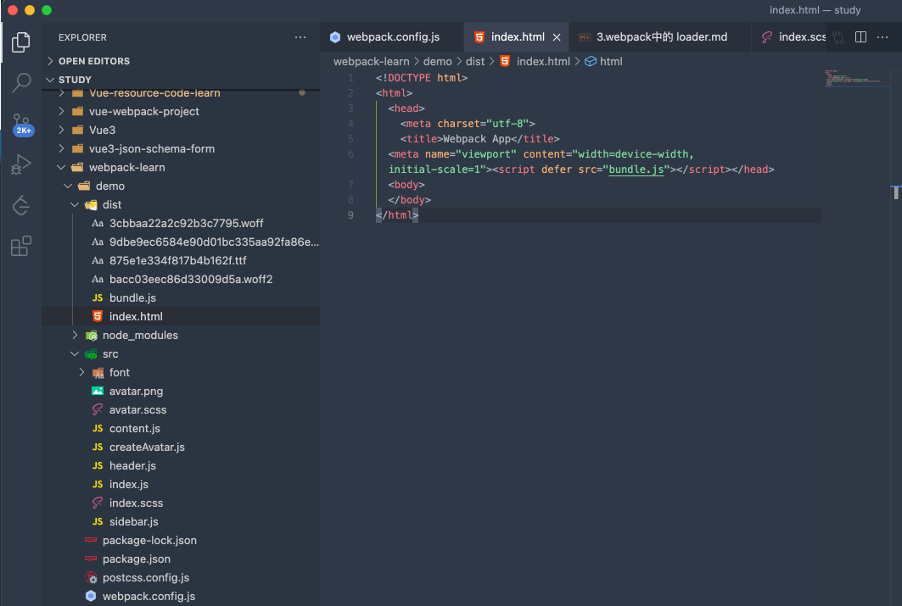

# 6.webpack 中的 plugins

## `html-webpack-plugin`

在生成的 dist 目录中, index.html 是手动增加的,而且内容也要手动添加,引用正确的路径文件

通过 `HtmlWebpackPlugin` 即可解决该问题

在 `webpack.config.js` 中引入 `html-webpack-plugin`, 并做如下配置

```javascript
// webpack.config.js

const path = require('path')
const HtmlWebpackPlugin = require('html-webpack-plugin')


module.exports = {
  // ... 其他配置项,entry, output, module...
  plugins: [
    new HtmlWebpackPlugin()
  ]
}
```

执行打包命令,在 dist 目录下会生成 index.html 文件



html-webpack-plugin 作用:**` `**

但是在本例中, 生成的 index.html 中缺少 `<div id="root"></div>` 代码,导致程序报错, 因此需要满足在生成的 index.html 中带有 `<div id="root"></div>`, 可以在 `webpack.config.js` 作如下模板配置

```javascript
// webpack.config.js

const path = require('path')
const HtmlWebpackPlugin = require('html-webpack-plugin')


module.exports = {
  // ... 其他配置项,entry, output, module...
  plugins: [
    new HtmlWebpackPlugin({
      template: 'src/index.html'  // 配置模板文件
    })
  ]
}
```

打包出来的 index.html 是以 src 目录下的 index.html 为模板生成的,同时一会把生成的 js 文件,以 script 标签的形式引入


**`plugin 作用的总结: 可以在webpack 运行到某个时刻, 做一些事情,类似于 Vue 中的生命周期函数. html-webpack-plugin 的作用就是在打包结束之后的时刻,生成一个 html 文件,并把生成的 js 通过 script 引入. 其他的插件会在另外的一些时刻帮助 webpack 做一些事情`**

## `clean-webpack-plugin`

当修改 webpack.config.js 中的 output 的 filename 为 dist.js 时,再次打包在 dist 目录下会生成 dist.js 文件,但是之前的 bundle.js 也会存在. 希望再重新打包时,能够自动把 dist 目录先删除, 然后在执行打包,这样之前的 bundle.js 就不会存在了,借助 `clean-webpack-plugin` 可以实现

在 webpack.config.js 中做如下配置

```javascript
// webpack.config.js

const path = require('path')
const HtmlWebpackPlugin = require('html-webpack-plugin')
const CleanWebpackPlugin = require('clean-webpack-plugin')

module.exports = {
  // ... 其他配置项,entry, output, module...
  plugins: [
    new HtmlWebpackPlugin({
      template: 'src/index.html'  // 配置模板文件
    }),
    new CleanWebpackPlugin() 
  ]
}
```
