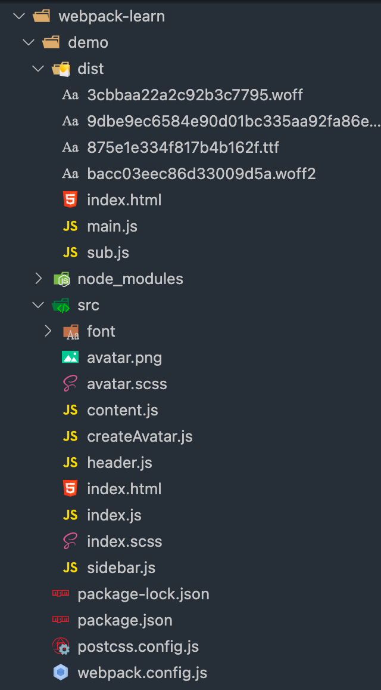

# 7.webpack 的 entry 和 output 的基础配置

当前的 webpack.config.js 中入口和出口的配置如下

```javascript
// webpack.config.js

const path = require('path')

module.exports = {
  entry: {
    main: './src/index.js'
  },
  output: {
    filename: 'bundle.js',
    path: path.resolve(__dirname, 'dist')
  }
}
```

打包的入口是从 src 下的 index.js,打包输出的文件名叫 bundle.js

其中: 

* `entry: { main: './src/index.js' } <=> entry: './src/index.js'`
* bundle.js 是 output 配置了打包输出的文件名为 bundle.js. 如果去掉  filename 的配置项,则打包输出的文件名为 main.js(entry 的 key)

如果需要把 src 下的 index.js 反复打包两次,生成两个文件,第一个文件叫做 main.js, 第二个文件叫做 sub.js,在入口处做如下配置

```javascript
// webpack.config.js

const path = require('path')

module.exports = {
  entry: {
    main: './src/index.js',
    sub: './src/index.js'
  },
  output: {
    // filename: 'bundle.js',
    filename: '[name].js' // 占位符, name 对应 entry 中的 key
    path: path.resolve(__dirname, 'dist')
  }
}
```

此时打包生成的文件如下



把打包生成的 index.html 作为后端访问的页面文件,其他的静态文件需要放在 CDN 上,那么打包生成的 index.html 文件中引用的 js 文件,需要拼接对应的 CDN 的域名

```xml
<!DOCTYPE html>
<html lang="en">

<head>
  <meta charset="UTF-8">
  <meta http-equiv="X-UA-Compatible" content="IE=edge">
  <meta name="viewport" content="width=device-width, initial-scale=1.0">
  <title>Html 模板</title>
  <script defer src="http://www.cdn.com/main.js"></script><script defer src="http://www.cdn.com/sub.js"></script>
</head>

<body>
  <div id="root"></div>
</body>

</html>
```

可以在 output 中做如下配置:

```javascript
// webpack.config.js

const path = require('path')

module.exports = {
  entry: {
    main: './src/index.js',
    sub: './src/index.js'
  },
  output: {
    // filename: 'bundle.js',
    filename: '[name].js' // 占位符, name 对应 entry 中的 key
    path: path.resolve(__dirname, 'dist'),
    publicPath: 'http://www.cdn.com'
  }
}

```

打包出来的 index.html 文件的内容:


