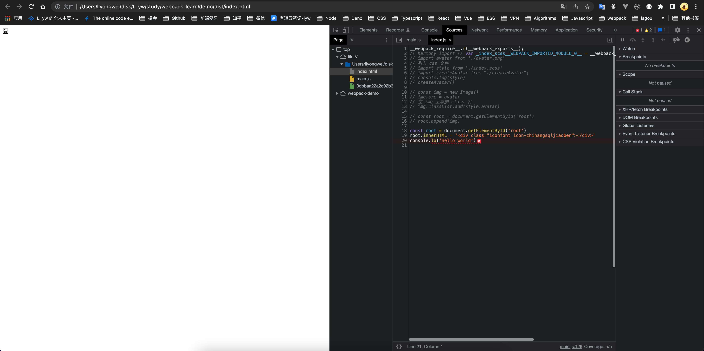
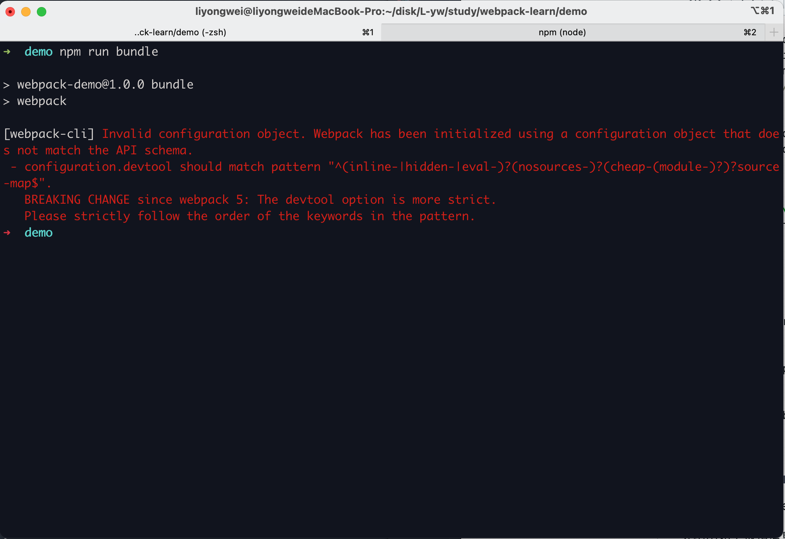
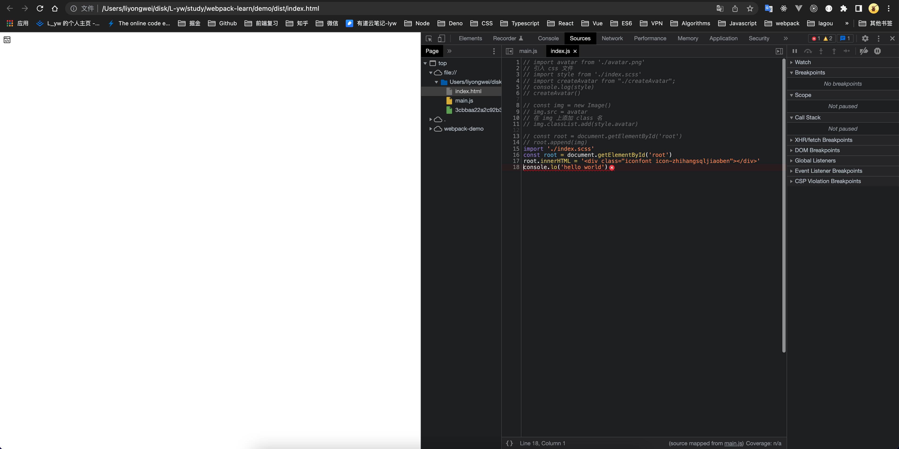

# 8.webpack中 sourceMap 的配置

修改当前的 `webpack.config.js` 的配置

```javascript
const path = require('path')
const HtmlWebpackPlugin = require('html-webpack-plugin')
const { CleanWebpackPlugin } = require('clean-webpack-plugin')

module.exports = {
  mode: 'development',
  entry: {
    main: './src/index.js',
  },
  module: {
    rules: [
      {
        test: /\.(jpg|png)$/,
        use: {
          // loader: 'file-loader',
          loader: 'url-loader',
          options: {
            name: '[name]_[hash].[ext]',
            outputPath: 'images/',
            limit: 2048
          }
        }
      },
      {
        test: /\.scss$/,
        use: [
          { loader: 'style-loader' },
          {
            loader: 'css-loader',
            options: {
              importLoaders: 2,
              // modules: true
            }
          },
          { loader: 'sass-loader' },
          { loader: 'postcss-loader' }
        ]
      },
      {
        test: /\.(eot|ttf|svg)$/,
        use: { loader: 'file-loader' }
      }
    ]
  },
  output: {
    filename: '[name].js',
    path: path.resolve(__dirname, 'dist'),
  },
  plugins: [
    new HtmlWebpackPlugin({
      template: 'src/index.html'
    }),
    new CleanWebpackPlugin()
  ]
}
```

现在的模式是 development 开发模式,如果代码出错了,只是会在打包后的 js 中定位错误位置, 无法在源码中定位错误位置

## sourceMap

不配置 devtool 知道 dist 目录下 main.js 文件的出错位置

sourceMap 是一个映射关系, 知道 dist 目录下main.js 文件的某个位置实际上对应的是 src 目录下index.js 文件中的位置,当前其实是 index.js 中某个位置代码出错.本质上是一种映射关系



```javascript
const path = require('path')
const HtmlWebpackPlugin = require('html-webpack-plugin')
const { CleanWebpackPlugin } = require('clean-webpack-plugin')

module.exports = {
  mode: 'development',
  // 设置 sourceMap
  devtool: 'source-map',
  entry: {
    main: './src/index.js',
  },
  module: {
    rules: [
      {
        test: /\.(jpg|png)$/,
        use: {
          // loader: 'file-loader',
          loader: 'url-loader',
          options: {
            name: '[name]_[hash].[ext]',
            outputPath: 'images/',
            limit: 2048
          }
        }
      },
      {
        test: /\.scss$/,
        use: [
          { loader: 'style-loader' },
          {
            loader: 'css-loader',
            options: {
              importLoaders: 2,
              // modules: true
            }
          },
          { loader: 'sass-loader' },
          { loader: 'postcss-loader' }
        ]
      },
      {
        test: /\.(eot|ttf|svg)$/,
        use: { loader: 'file-loader' }
      }
    ]
  },
  output: {
    filename: '[name].js',
    path: path.resolve(__dirname, 'dist'),
  },
  plugins: [
    new HtmlWebpackPlugin({
      template: 'src/index.html'
    }),
    new CleanWebpackPlugin()
  ]
}

```

在 webpack 5中 devtool 不会存在 none 的配置项

会给出如下报错信息



所以,配置devtool: 'source-map'

再次打包,这次会给出源码中出错的位置



同时在 dist 目录下会生成一个 .map 结尾的文件,是一个映射关系的文件

* inline-source-map: .map 文件会放在打包后的 js 文件中
* inline-cheap-source-map: 当代码量很大时, inline-source-map会具体到某行某列的出错位置,这样的映射很耗费性能,inline-cheap-source-map 只会提示错误出现的行,体会映射自己写的业务代码,不会顾及三方的模块
* cheap-module-source-map: 不仅映射自己编写业务代码的错误,还会映射第三方模块的错误
* eval: dist 目录下不会有.map 文件, 也不会把.map 文件放在打包生成的 js 文件中. 是通过 eval 函数执行源码 ,并产生对应关系

## 最佳实践

* 开发环境: 建议使用 devtool: 'eval-cheap-module-source-map'
* 线上环境: 建议使用 devtool: 'cheap-module-source-map'
